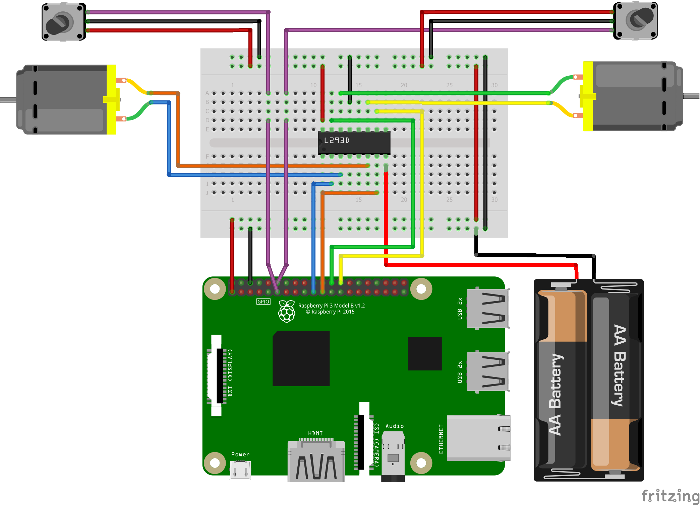

## You'll need a robot

Encoders come in all shapes, sizes, and accuracies. They can be incorporated into motors themselves or as add-ons that connect to the motor shaft or the wheel, but fundamentally they all work in the same way — a consistent signal is provided as the motor turns; the faster the motor is turning, the faster the signal.

A typical robot setup includes a motor controller (or maybe a dedicated HAT), two motors, and a battery pack. In addition, you will need an encoder per motor connected to your Raspberry Pi.

Most encoders will have three or four pins (power, ground, and one or two signal pins); typically the power and ground pins will be connected to a 3.3V and a ground (GND) pin on your Pi; one of the signal pins should be connected to a spare GPIO pin. It’s important to check the specifications of your encoders before connecting them up to the Raspberry Pi.

--- collapse ---
---
title: Two pin PID controllers
---
Your robot maybe fitted with ‘quadrature’ encoders; these encoders use two pins, significantly increase the resolution, and allow the direction the motor is spinning to be determined.
This tutorial assumes you are using simple one-pin pulse encoders, but there is a code example [here](https://github.com/martinohanlon/RobotPID) which should allow you to modify it. There’s also an excellent write-up [here](http://robotoid.com/appnotes/circuits-quad-encoding.html) which explains how they work and how to interpret the signals from them.
--- /collapse ---

