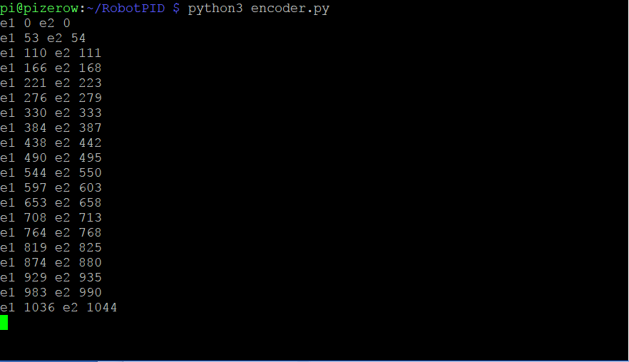

## Initial code

1. Open up a Python 3 editor (e.g. Thonny) and create a new program.

2. Import the required Python modules:
~~~ python
from gpiozero import Robot, DigitalInputDevice
from time import sleep
~~~

3. Create a constant for sample time – this is how often (in seconds) your program will read the values from the encoders – it’s likely that you will need to change this value later to get the best result from your setup:
`SAMPLETIME = 1`

4. Create an Encoder class to monitor your encoders; this will increment a value each time the pin turns on and off.
	~~~ python
	class Encoder(object):
		def __init__(self, pin):
			self._value = 0
			encoder = DigitalInputDevice(pin)
			encoder.when_activated = self._increment
			encoder.when_deactivated = self._increment
		def reset(self):
			self._value = 0
		def _increment(self):
			self._value += 1
	@property
	   def value(self):
			return self._value
	~~~

5. Use the gpiozero Robot class to connect to your motor hardware; each motor will connect to two GPIO pins (one forward, one back), specified as ((left_forward, left_backward), (right_forward, right_backward)) – our robot uses the pins ((10,9), (8,7)):
`r = Robot((10,9), (8,7))`

6. Create two Encoder objects passing the GPIO pin the signal connects too; we’ve used GPIO pins 17 and 18: 
~~~ python
e1 = Encoder(17)
e2 = Encoder(18)
~~~

7. Start the robot by making the value of both motors 1.0 (forward at full speed):
~~~ python
m1_speed = 1.0
m2_speed = 1.0
r.value = (m1_speed, m2_speed)
~~~

8. Start an infinite loop and print the encoder values:
~~~ python
	while True:
		print("e1 {} e2 {}".format(e1.value, e2.value)
		sleep(SAMPLETIME)
~~~

9. Run the program.

View the complete encoder.py code listing at github.com/martinohanlon/RobotPID.

The SAMPLETIME value should be changed to reflect your hardware; you need to find a balance between reading it frequently enough to get good results and slow enough to capture sufficient encoder ticks – try values between 0.1 and 1.0 seconds and aim to capture more than 20 ticks per sample. 

Make a note of approximately how many encoder ticks per sample your robot makes.

